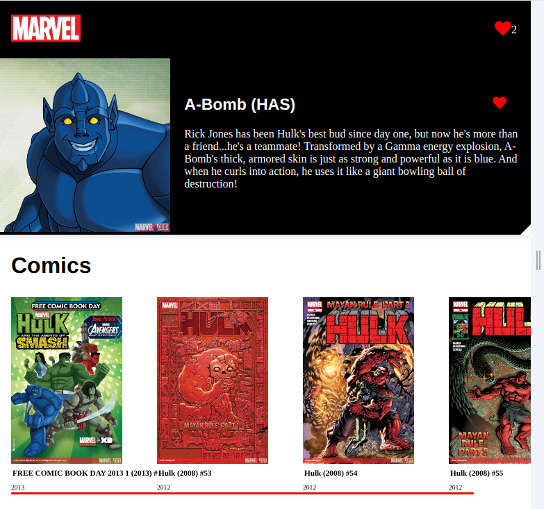
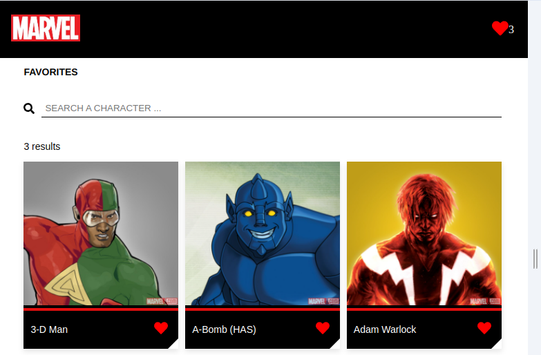
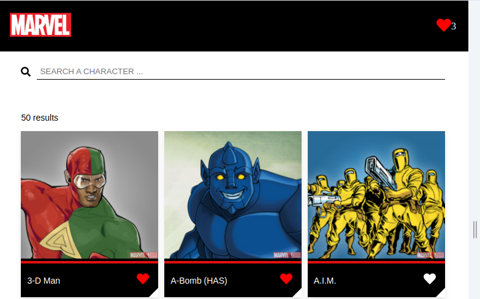

# Web Challenge Marvel

## Descripción
Este proyecto es una aplicación web que muestra información sobre personajes y cómics del universo Marvel. Utiliza la API pública de Marvel para obtener datos sobre los personajes y cómics disponibles.

## Funcionalidades
- Visualización de personajes de Marvel.
- Detalles de cada personaje, incluyendo su nombre, imagen y descripción.
- Posibilidad de marcar personajes como favoritos.
- Visualización de cómics relacionados con cada personaje.
- Diseño responsive para adaptarse a diferentes dispositivos.

## Instalación
1. Clona el repositorio en tu máquina local: `git clone <URL_DEL_REPOSITORIO>`.
2. Navega al directorio del proyecto: `cd web-challenge-marvel`.
3. Instala las dependencias utilizando el comando: `npm install`.
4. Crea un archivo `.env` en la raíz del proyecto y configura las siguientes variables de entorno:

5. Ejecuta la aplicación utilizando el comando: `npm start`.

## Configuración de Variables de Entorno

Para ejecutar la aplicación localmente o en un entorno de producción, necesitarás configurar las siguientes variables de entorno:

- `REACT_APP_API_BASE_URL`: La URL base de la API de Marvel. "'https://gateway.marvel.com:443'"
- `REACT_APP_API_KEY_PUBLIC`: La clave pública de la API de Marvel.
- `REACT_APP_API_KEY_PRIVATE`: La clave privada de la API de Marvel.

Asegúrate de que estas variables estén configuradas correctamente antes de ejecutar la aplicación.

## Pruebas y Construcción
- Ejecutar pruebas: `npm test`
- Construir la aplicación para producción: `npm run build`

## Uso
Una vez que la aplicación esté en funcionamiento, podrás navegar por los diferentes personajes de Marvel, ver sus detalles y marcar tus favoritos. También puedes explorar los cómics asociados a cada personaje.

